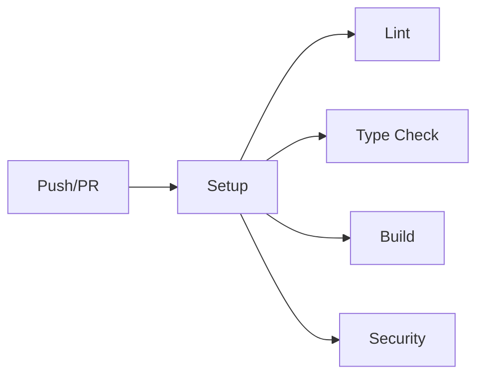

# CI ワークフロー

継続的インテグレーション（CI）のワークフローを管理するディレクトリです。

## 🎯 目的

コード品質とビルドの健全性を自動的に検証し、問題を早期発見します。

## 📋 ワークフロー

### `main.yml` - メインCI統合

すべてのCIジョブを統合的に実行します。

**トリガー**:
- プッシュ（`main`, `latest`ブランチ）
- プルリクエスト

**実行内容**:
```yaml
jobs:
  - setup      # 環境セットアップ
  - lint       # リント
  - type-check # 型チェック
  - build      # ビルド
  - security   # セキュリティ
```

### `ci-setup.yml` - 環境セットアップ

Node.js環境と依存関係の準備を行います。

**機能**:
- Node.js 20.xのセットアップ
- pnpmのインストール
- 依存関係のキャッシュ管理
- `node_modules`のインストール

### `ci-lint.yml` - リント検証

ESLintによるコード品質チェックを実行します。

**検証項目**:
- コードスタイル
- ベストプラクティス遵守
- 潜在的なバグの検出

### `ci-type-check.yml` - 型チェック

TypeScriptの型安全性を検証します。

**検証項目**:
- 型エラーの検出
- 型定義の整合性
- 型推論の妥当性

### `ci-build.yml` - ビルド検証

Next.jsアプリケーションのビルドを検証します。

**検証項目**:
- ビルド成功の確認
- 生成物の検証
- ビルドエラーの早期検出

### `ci-security.yml` - セキュリティスキャン

依存関係の脆弱性をチェックします。

**検証項目**:
- `npm audit`の実行
- 既知の脆弱性の検出
- セキュリティアドバイザリの確認

## 🔄 実行フロー



## ⚡ 最適化

- **キャッシュ戦略**: 依存関係とビルド成果物をキャッシュ
- **並列実行**: Setup後のジョブは並列実行
- **早期失敗**: エラー発生時は即座に停止

## 🎯 成功基準

すべてのCIジョブが成功することで：
- ✅ コード品質が保証される
- ✅ 型安全性が確保される
- ✅ ビルドが成功する
- ✅ セキュリティリスクがない

## 🔗 関連ドキュメント

- [../README.md](../README.md) - ワークフロー全体の説明
- [../../../docs/development/24-ci-workflow-modularization.md](../../../docs/development/24-ci-workflow-modularization.md)
