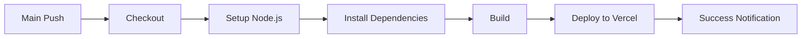

# Deploy ワークフロー

本番環境へのデプロイを管理するディレクトリです。

## 🎯 目的

アプリケーションを本番環境に自動的にデプロイします。

## 📋 ワークフロー

### `main.yml` - メインデプロイワークフロー

Vercelへの自動デプロイを実行します。

**トリガー**:
- `main`ブランチへのプッシュ
- 手動実行（workflow_dispatch）

**デプロイ先**: Vercel

**実行内容**:
1. リポジトリのチェックアウト
2. Node.js環境のセットアップ
3. 依存関係のインストール
4. ビルドの実行
5. Vercelへのデプロイ

## 🚀 デプロイフロー

## 🔧 環境設定

### 必要なシークレット

デプロイには以下のGitHub Secretsが必要です：

- `VERCEL_TOKEN`: Vercelのデプロイトークン
- `VERCEL_ORG_ID`: VercelのOrganization ID
- `VERCEL_PROJECT_ID`: VercelのProject ID

### 設定方法

1. GitHubリポジトリの「Settings」→「Secrets and variables」→「Actions」
2. 必要なシークレットを追加

## ⚡ デプロイ戦略

- **自動デプロイ**: `main`ブランチへのマージで自動実行
- **手動デプロイ**: 必要に応じて手動実行可能
- **ロールバック**: 問題発生時はVercelダッシュボードから前のバージョンに戻せる

## 🎯 成功基準

デプロイが成功すると：
- ✅ 最新のコードが本番環境に反映される
- ✅ Vercelで新しいデプロイメントが作成される
- ✅ デプロイURLが生成される

## 📊 デプロイ履歴

デプロイ履歴は以下で確認できます：
- GitHub Actions: リポジトリの「Actions」タブ
- Vercel Dashboard: https://vercel.com/dashboard

## 🔗 関連ドキュメント

- [../README.md](../README.md) - ワークフロー全体の説明
- [Vercel Documentation](https://vercel.com/docs)
