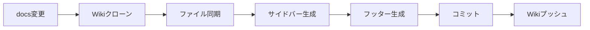

# Wiki ワークフロー

GitHub Wikiへのドキュメント自動同期を管理するディレクトリです。

## 🎯 目的

`docs/development/`ディレクトリのMarkdownファイルを自動的にGitHub Wikiに同期します。

## 📋 ワークフロー

### `sync.yml` - Wiki自動同期

ローカルのMarkdownファイルをGitHub Wikiにアップロードします。

**トリガー**:
- `docs/development/**`の変更時
- 手動実行（workflow_dispatch）

**同期対象**: 28個のMarkdownファイル

**実行内容**:
1. Wikiリポジトリのクローン
2. ドキュメントファイルの同期
3. Wikiサイドバーの自動生成
4. Wikiフッターの自動生成
5. メタデータの追加
6. Wikiリポジトリへのプッシュ

## 🔄 同期フロー



## 📁 同期されるファイル

以下のディレクトリから28個のMarkdownファイルが同期されます：

```
docs/development/
├── 01-project-overview.md
├── 02-docker-environment.md
├── 03-automation-tools.md
...
└── 27-github-actions-workflow-separation.md
```

## ✨ 自動生成される要素

### Wikiサイドバー (`_Sidebar.md`)

- カテゴリ別のドキュメントリンク
- 主要なドキュメントへのクイックアクセス
- 完全なインデックスへのリンク

### Wikiフッター (`_Footer.md`)

- 全ドキュメントへのリンク
- メインリポジトリへのリンク
- Issue報告リンク
- 最終同期時刻

### メタデータ

各ファイルに以下のメタデータが追加されます：
```markdown
<!-- Auto-synced from docs/development/filename.md -->
<!-- Last sync: 2025-11-05 12:00:00 UTC -->
<!-- Commit: abc123... -->
```

## 🔧 認証設定

Wikiへのプッシュには`GITHUB_TOKEN`を使用します（自動的に利用可能）。

## ⚡ 機能

### ファイル検証
- 各ファイルの読み取り可能性を確認
- コピー成功を個別に検証
- 失敗時は詳細なエラー情報を表示

### リトライ機能
- プッシュ失敗時は最大3回リトライ
- リトライ前に自動リベース
- 指数バックオフによる待機時間

### 詳細ログ
- 同期プロセス全体の可視化
- 成功/失敗ファイル数のレポート
- GitHub Actions Summaryでの詳細レポート

## 🎯 成功基準

Wiki同期が成功すると：
- ✅ 28個すべてのMarkdownファイルがWikiにアップロード
- ✅ サイドバー・フッターが自動生成
- ✅ 各ファイルにメタデータが追加
- ✅ Wiki が最新状態に更新

## 📊 同期統計

同期完了時に以下の情報が表示されます：
- 同期されたファイル数
- 成功/失敗の内訳
- Wiki URL
- 最終同期時刻

## 🔗 Wiki アクセス

同期されたWikiは以下からアクセスできます：
- **Wiki Home**: https://github.com/Shiori-Takanashi/next-tpl/wiki
- **完全なインデックス**: https://github.com/Shiori-Takanashi/next-tpl/wiki/README

## 🐛 トラブルシューティング

### Wikiが初期化されていない

Wikiが存在しない場合：
1. https://github.com/Shiori-Takanashi/next-tpl/wiki にアクセス
2. "Create the first page" をクリック
3. 適当な内容を入力して保存
4. ワークフローを再実行

### プッシュが失敗する

- リポジトリ設定でWikiが有効化されているか確認
- GitHub Actions の権限設定を確認
- ワークフローログで詳細なエラーメッセージを確認

## 🔗 関連ドキュメント

- [../README.md](../README.md) - ワークフロー全体の説明
- [../../../docs/development/26-github-wiki-migration-strategy.md](../../../docs/development/26-github-wiki-migration-strategy.md)
- [../../../docs/development/27-github-actions-workflow-separation.md](../../../docs/development/27-github-actions-workflow-separation.md)
