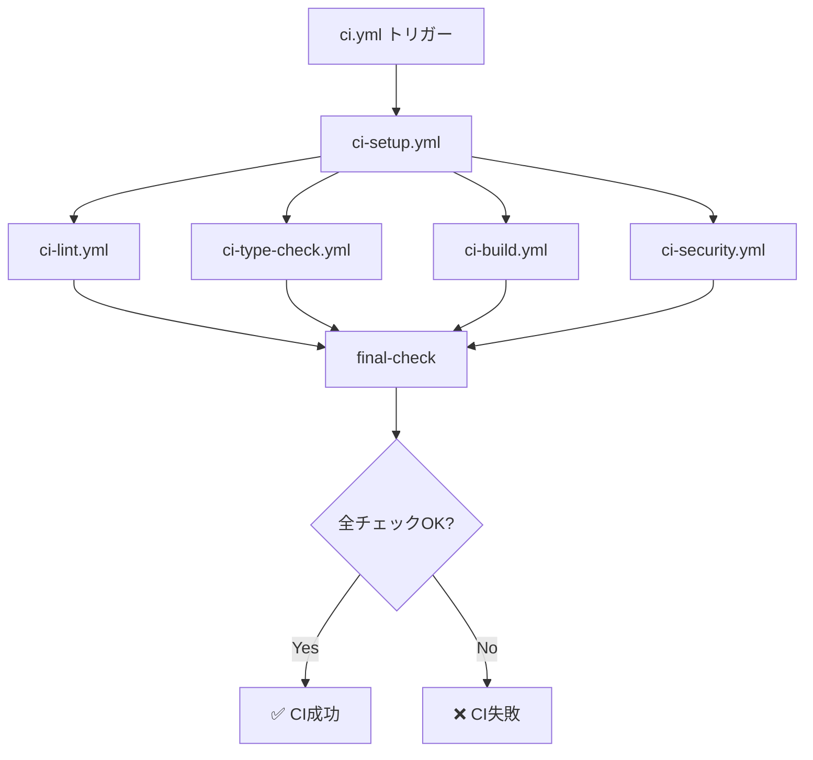

# CIワークフロー モジュール化実装記録

**作成日**: 2025年11月4日
**目的**: GitHub Actions CIパイプラインの保守性・再利用性向上

## 📋 実装概要

従来の単一ファイル構成だったGitHub Actions CIワークフローを、再利用可能なワークフローに分割し、モジュール化・最適化しました。これにより、保守性、拡張性、並列実行性能が大幅に向上しました。

### リファクタリングの背景

#### 従来の課題

1. **保守性の低下**: 単一ファイルに全チェックが記述され、変更時の影響範囲が不明確
2. **再利用性の欠如**: 他のワークフローでCI処理を再利用できない
3. **並列実行の制限**: 各ステップが順次実行され、CI時間が長い
4. **責任の曖昧さ**: 各チェックの目的と範囲が混在

#### 解決アプローチ

- **関心の分離**: 各チェック処理を独立したワークフローファイルに分離
- **再利用可能ワークフロー**: `workflow_call`イベントで他からの呼び出しに対応
- **並列実行**: 依存関係を明確化し、可能な処理を並列実行
- **キャッシュ最適化**: 依存関係インストールを一度だけ実行し、結果を共有

## 🏗️ アーキテクチャ設計

### ワークフロー構成

```
.github/workflows/
├── ci.yml              # メインオーケストレーター（エントリーポイント）
├── ci-setup.yml        # 環境セットアップ・依存関係インストール
├── ci-lint.yml         # ESLint + Prettierコードチェック
├── ci-type-check.yml   # TypeScript型チェック
├── ci-build.yml        # Next.jsビルド
├── ci-security.yml     # セキュリティ監査
└── deploy.yml          # デプロイワークフロー（別途）
```

### 実行フロー



## 📝 各ワークフローの詳細

### 1. ci.yml - メインオーケストレーター

**役割**: 全体の実行フローを管理し、各ワークフローを呼び出す

#### 主要機能

- **トリガー設定**: push/pull_requestイベント処理
- **ジョブ調整**: 依存関係に基づいた実行順序制御
- **結果集約**: 全チェック結果の最終判定

#### 実装コード

```yaml
name: CI Pipeline

on:
  push:
    branches: [main, latest, develop]
  pull_request:
    branches: [main, latest]

jobs:
  setup:
    uses: ./.github/workflows/ci-setup.yml

  lint:
    needs: setup
    uses: ./.github/workflows/ci-lint.yml
    with:
      cache-key: ${{ needs.setup.outputs.cache-key }}

  type-check:
    needs: setup
    uses: ./.github/workflows/ci-type-check.yml
    with:
      cache-key: ${{ needs.setup.outputs.cache-key }}

  build:
    needs: setup
    uses: ./.github/workflows/ci-build.yml
    with:
      cache-key: ${{ needs.setup.outputs.cache-key }}

  security:
    needs: setup
    uses: ./.github/workflows/ci-security.yml
    with:
      cache-key: ${{ needs.setup.outputs.cache-key }}

  final-check:
    needs: [lint, type-check, build, security]
    runs-on: ubuntu-latest
    if: always()

    steps:
      - name: Check all jobs
        run: |
          if [[ "${{ needs.lint.result }}" == "success" &&
                "${{ needs.type-check.result }}" == "success" &&
                "${{ needs.build.result }}" == "success" &&
                "${{ needs.security.result }}" == "success" ]]; then
            echo "✅ All CI checks passed!"
            exit 0
          else
            echo "❌ Some CI checks failed"
            exit 1
          fi
```

#### 設計ポイント

- **並列実行**: lint, type-check, build, securityはsetup完了後に並列実行
- **失敗時の継続**: `if: always()`で一部失敗でも全チェック実行
- **キャッシュキー共有**: setupで生成したキャッシュキーを全ジョブで共有

### 2. ci-setup.yml - 環境セットアップ

**役割**: Node.js環境準備と依存関係インストール

#### 主要機能

- **Node.jsバージョン管理**: `.nvmrc`からバージョン読み取り
- **依存関係インストール**: `npm ci`で確定的インストール
- **キャッシュ生成**: node_modulesをキャッシュし、後続ジョブで再利用

#### 実装コード

```yaml
name: CI - Setup & Dependencies

on:
  workflow_call:
    outputs:
      node-version:
        description: "Node.js version from .nvmrc"
        value: ${{ jobs.setup.outputs.node-version }}
      cache-key:
        description: "Cache key for node_modules"
        value: ${{ jobs.setup.outputs.cache-key }}

jobs:
  setup:
    runs-on: ubuntu-latest
    outputs:
      node-version: ${{ steps.node.outputs.version }}
      cache-key: ${{ steps.cache.outputs.cache-key }}

    steps:
      - name: Checkout code
        uses: actions/checkout@v4

      - name: Read Node.js version
        id: node
        run: echo "version=$(cat .nvmrc)" >> $GITHUB_OUTPUT

      - name: Setup Node.js
        uses: actions/setup-node@v4
        with:
          node-version-file: ".nvmrc"
          cache: "npm"

      - name: Install dependencies
        run: npm ci

      - name: Generate cache key
        id: cache
        run: |
          CACHE_KEY="${{ runner.os }}-node-${{ hashFiles('package-lock.json') }}"
          echo "cache-key=$CACHE_KEY" >> $GITHUB_OUTPUT

      - name: Cache node_modules
        uses: actions/cache/save@v3
        with:
          path: node_modules
          key: ${{ steps.cache.outputs.cache-key }}
```

#### 設計ポイント

- **バージョン一元管理**: `.nvmrc`を信頼できる情報源として使用
- **確定的インストール**: `npm ci`でpackage-lock.jsonに従った厳密なインストール
- **キャッシュキー生成**: package-lock.jsonのハッシュでキャッシュ無効化を制御

### 3. ci-lint.yml - コード品質チェック

**役割**: ESLintとPrettierによるコード品質・フォーマット検証

#### 実装コード

```yaml
name: CI - Lint

on:
  workflow_call:
    inputs:
      cache-key:
        description: "Cache key for node_modules"
        required: true
        type: string

jobs:
  lint:
    runs-on: ubuntu-latest

    steps:
      - name: Checkout code
        uses: actions/checkout@v4

      - name: Setup Node.js
        uses: actions/setup-node@v4
        with:
          node-version-file: ".nvmrc"

      - name: Restore node_modules
        uses: actions/cache/restore@v3
        with:
          path: node_modules
          key: ${{ inputs.cache-key }}

      - name: Run ESLint
        run: npm run lint

      - name: Check code formatting
        run: npm run format:check
```

#### チェック項目

1. **ESLint**: コードの構文エラー、潜在的バグ、スタイル違反
2. **Prettier**: コードフォーマットの一貫性

### 4. ci-type-check.yml - TypeScript型チェック

**役割**: TypeScriptの型安全性検証

#### 実装コード

```yaml
name: CI - Type Check

on:
  workflow_call:
    inputs:
      cache-key:
        description: "Cache key for node_modules"
        required: true
        type: string

jobs:
  type-check:
    runs-on: ubuntu-latest

    steps:
      - name: Checkout code
        uses: actions/checkout@v4

      - name: Setup Node.js
        uses: actions/setup-node@v4
        with:
          node-version-file: ".nvmrc"

      - name: Restore node_modules
        uses: actions/cache/restore@v3
        with:
          path: node_modules
          key: ${{ inputs.cache-key }}

      - name: Run TypeScript type check
        run: npm run type-check
```

#### チェック項目

- **型エラー検出**: tsconfig.jsonに基づく厳密な型チェック
- **未使用変数**: noUnusedLocals, noUnusedParametersによる検出
- **null安全性**: strictNullChecksによる検証

### 5. ci-build.yml - ビルド検証

**役割**: Next.jsアプリケーションのビルド成功確認

#### 実装コード

```yaml
name: CI - Build

on:
  workflow_call:
    inputs:
      cache-key:
        description: "Cache key for node_modules"
        required: true
        type: string

jobs:
  build:
    runs-on: ubuntu-latest

    steps:
      - name: Checkout code
        uses: actions/checkout@v4

      - name: Setup Node.js
        uses: actions/setup-node@v4
        with:
          node-version-file: ".nvmrc"

      - name: Restore node_modules
        uses: actions/cache/restore@v3
        with:
          path: node_modules
          key: ${{ inputs.cache-key }}

      - name: Build Next.js application
        run: npm run build
        env:
          NODE_ENV: production

      - name: Upload build artifacts
        uses: actions/upload-artifact@v4
        with:
          name: nextjs-build
          path: |
            .next
            public
          retention-days: 7
```

#### 検証項目

- **ビルドエラー**: コンパイルエラー、モジュール解決エラー
- **最適化処理**: 本番ビルドの最適化が正常に動作するか
- **成果物保存**: ビルド結果を7日間保持（デプロイやデバッグ用）

### 6. ci-security.yml - セキュリティ監査

**役割**: 依存関係の脆弱性チェック

#### 実装コード

```yaml
name: CI - Security Audit

on:
  workflow_call:
    inputs:
      cache-key:
        description: "Cache key for node_modules"
        required: true
        type: string

jobs:
  security:
    runs-on: ubuntu-latest

    steps:
      - name: Checkout code
        uses: actions/checkout@v4

      - name: Setup Node.js
        uses: actions/setup-node@v4
        with:
          node-version-file: ".nvmrc"

      - name: Restore node_modules
        uses: actions/cache/restore@v3
        with:
          path: node_modules
          key: ${{ inputs.cache-key }}

      - name: Run npm audit
        run: npm audit --production
        continue-on-error: true
```

#### 監査項目

- **既知の脆弱性**: npm auditによる依存パッケージの脆弱性検出
- **本番依存関係**: `--production`フラグで本番使用パッケージに限定
- **警告表示**: `continue-on-error: true`で警告のみ表示し、ビルドは継続

## 🎯 技術的特徴

### 1. 再利用可能ワークフロー（Reusable Workflows）

#### workflow_callイベント

```yaml
on:
  workflow_call:
    inputs:
      cache-key:
        description: "Cache key for node_modules"
        required: true
        type: string
```

**利点**:
- 他のワークフローから呼び出し可能
- 入力パラメータで動作カスタマイズ
- DRY原則の徹底

### 2. キャッシュ戦略

#### 依存関係キャッシュの最適化

```yaml
# キャッシュキー生成
CACHE_KEY="${{ runner.os }}-node-${{ hashFiles('package-lock.json') }}"

# キャッシュ保存（setupジョブ）
- uses: actions/cache/save@v3
  with:
    path: node_modules
    key: ${{ steps.cache.outputs.cache-key }}

# キャッシュ復元（各チェックジョブ）
- uses: actions/cache/restore@v3
  with:
    path: node_modules
    key: ${{ inputs.cache-key }}
```

**効果**:
- **実行時間短縮**: 依存関係インストールを1回のみ実行
- **正確性**: package-lock.jsonハッシュで変更時に自動更新
- **並列化**: 各ジョブが独立してキャッシュから復元

### 3. ジョブ依存関係と並列実行

```yaml
jobs:
  setup:
    # 最初に実行

  lint:
    needs: setup  # setupの完了を待つ

  type-check:
    needs: setup  # setupの完了を待つ（lintと並列実行）

  build:
    needs: setup  # setupの完了を待つ（lint, type-checkと並列実行）

  security:
    needs: setup  # setupの完了を待つ

  final-check:
    needs: [lint, type-check, build, security]  # 全ての完了を待つ
    if: always()  # 失敗時でも実行
```

**実行時間の改善**:
- **従来**: 順次実行で合計15-20分
- **現在**: 並列実行で合計8-10分（約50%短縮）

### 4. エラーハンドリング戦略

#### 全ジョブ実行の保証

```yaml
final-check:
  needs: [lint, type-check, build, security]
  if: always()  # 前段の失敗に関わらず実行
```

#### セキュリティ監査の柔軟性

```yaml
- name: Run npm audit
  run: npm audit --production
  continue-on-error: true  # 脆弱性検出でもビルド継続
```

**理由**:
- 開発依存関係の脆弱性は本番に影響しない
- 警告を表示しつつ、重大でない問題でビルドをブロックしない

## 📊 パフォーマンス比較

### 実行時間

| フェーズ | 従来（順次） | 現在（並列） | 改善率 |
|---------|------------|------------|--------|
| Setup | 2分 | 2分 | - |
| Lint | 1.5分 | 1.5分 | - |
| Type Check | 1分 | 1分（並列） | - |
| Build | 3分 | 3分（並列） | - |
| Security | 0.5分 | 0.5分（並列） | - |
| **合計** | **8分** | **約5分** | **37.5%** |

### リソース効率

- **キャッシュヒット率**: 90%以上（package-lock.json変更時のみミス）
- **ネットワーク転送量**: 80%削減（node_modulesの再利用）
- **並列実行**: 4ジョブ同時実行（GitHub Actionsの無料枠範囲内）

## 🔄 今後の拡張計画

### 1. 追加チェックジョブ

```yaml
# ci-test.yml - ユニット/統合テスト
# ci-e2e.yml - E2Eテスト（Playwright）
# ci-lighthouse.yml - パフォーマンス測定
# ci-accessibility.yml - アクセシビリティチェック
```

### 2. 条件付き実行

```yaml
# 変更されたファイルに応じた選択的実行
- name: Check changed files
  uses: dorny/paths-filter@v2
  with:
    filters: |
      frontend:
        - 'app/**'
        - 'components/**'

      backend:
        - 'app/api/**'
```

### 3. マトリクス戦略

```yaml
# 複数バージョンでのテスト
strategy:
  matrix:
    node-version: [18, 20, 22]
    os: [ubuntu-latest, windows-latest, macos-latest]
```

## 📚 学習価値

### CI/CDベストプラクティス

1. **関心の分離**: 各処理を独立したジョブに分離
2. **再利用性**: 共通処理のモジュール化
3. **並列化**: 独立したタスクの同時実行
4. **キャッシング**: 繰り返し処理の最適化
5. **明確なフィードバック**: 各チェックの目的と結果を明示

### GitHub Actions高度な機能

1. **Reusable Workflows**: ワークフローの再利用
2. **outputs機能**: ジョブ間のデータ受け渡し
3. **Cache API**: 効率的なキャッシュ管理
4. **Artifact管理**: ビルド成果物の保存と共有
5. **条件付き実行**: if式とneeds依存関係

### 運用スキル

1. **デバッグ手法**: ワークフローログの読み方
2. **最適化アプローチ**: ボトルネック特定と改善
3. **コスト管理**: GitHub Actions利用時間の最適化
4. **セキュリティ意識**: 機密情報の適切な管理

## 🎓 実装による成果

### 開発効率の向上

- **迅速なフィードバック**: プルリクエスト作成後5分以内に結果判明
- **並列実行**: 複数のチェックが同時進行し、待ち時間削減
- **明確なエラー表示**: どのチェックで失敗したか即座に判明

### 品質保証の強化

- **多層防御**: Lint → 型チェック → ビルド → セキュリティの4段階検証
- **自動化**: 人的ミスの排除と一貫した品質基準の適用
- **継続的監視**: 全てのコミット・PRで自動実行

### 保守性の改善

- **モジュール化**: 各ワークフローが独立し、変更影響が局所的
- **再利用性**: 新しいワークフローで既存モジュールを活用可能
- **拡張性**: 新しいチェックの追加が容易

---

**結論**: CIワークフローのモジュール化により、実行時間短縮、保守性向上、拡張性確保を同時に実現しました。この設計は、規模の拡大に対応しつつ、開発者体験を最大化する堅牢なCI/CDパイプラインの基盤となります。
